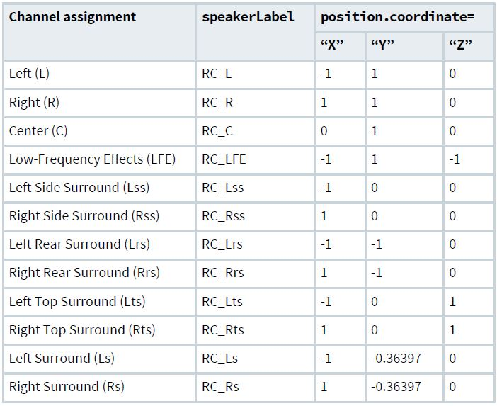
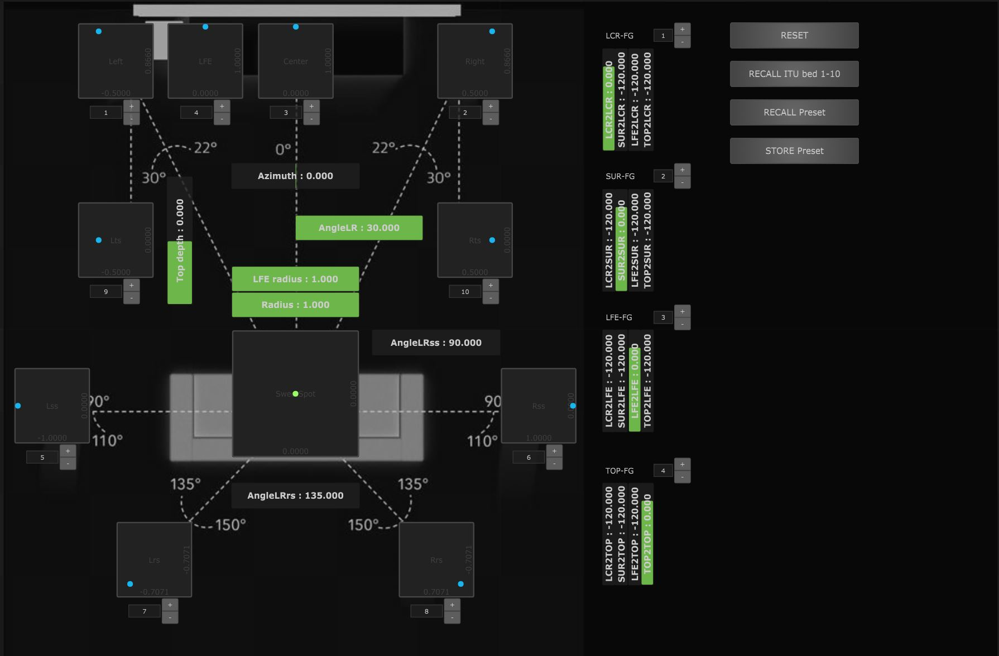

# Noisette_ADMix-Player-DS100
Example file for Chataigne DS100 module, mapping of ADMix Player objects positions.

A simple routing of ADMix Player parameters to DS100.
The ADM-OSC module is input only, receiving OSC "/track/" x, y, z of sound objects.

ADMixplayer is a free standalone ADM .BWF player, that can playback 64 channels of audio (usually connected to DS100 thru Dante Virtual Soundcard https://www.audinate.com/products/software/dante-virtual-soundcard ) and their encoded objects positions metadata thru OSC.

ADMix is also a part of Max/MSP Spat.5 free package.
To know more and download standalone ADMix https://forum.ircam.fr/projects/detail/admix/

To learn more about Chataigne, please visit : http://benjamin6.kuperberg.fr/chataigne/
This project has been tested with Chataigne v1.8

## ADM metadata format
is for Audio Definition Model, an open source metadata model that allows the format and content of audio files to be reliably described. 
Among other parameters, it allows to specify locations of sound sources.
Learn more by reading the ADM ITU BS.2076 standard : https://www.itu.int/dms_pubrec/itu-r/rec/bs/R-REC-BS.2076-2-201910-I!!PDF-E.pdf
ADM .BWF Files can be produced by ADmix tools, directly by DAW like Nuendo, or tools like Dolby Atmos Production Suite...

## How to setup
1. First install DS100 OSC module (in Chataigne/Files menu/Community module manager...). You can also download the module folder from https://github.com/madees/dbaudio-DS100-Chataigne-Module/archive/master.zip and manually unzip and copy the DS100 OSC module master folder in your ..Chataigne/modules/ folder).
2. Next, download file ADMixPlayer_Multiplex.noisette above
3. Launch Chataigne, load the .noisette file, and check DS100 IP settings
4. Prepare your DS100 with En-Scene objects, usually the 10 first channels are statics for the 9.1 bed, #11 to #128 may move. By default, they will be mapped to default module setting of coordinate mapping #1.
Here are recommended "virtual" speakers static objetcs positions for Atmos:

.

Or, you may use the ITU little helper in Dashboard to set up the objects 1 to 10 positions :

5. Don't forget to activate "send" in ADMix GUI OSC container, press play and enjoy !

## More to come
This example shows also how to map any Object based mixing coordinates to DS100 with Multiplex Mappings, you can apply it to any OSC dictionnary : Spat Revolution, L-Isa, SpaceMap Go, Yamaha Rivage surround panner...
You can try to map Z coordinate to FGOutputGain also if you have several Function Groups for elevation...

For global support on how to use Chataigne and its modules, or this example project, please join us on Discord : https://discord.com/invite/ngnJ5z 

If you need any help, my contact on Discord is also "madees". Any feedback or ideas on improvements or features are welcome !
